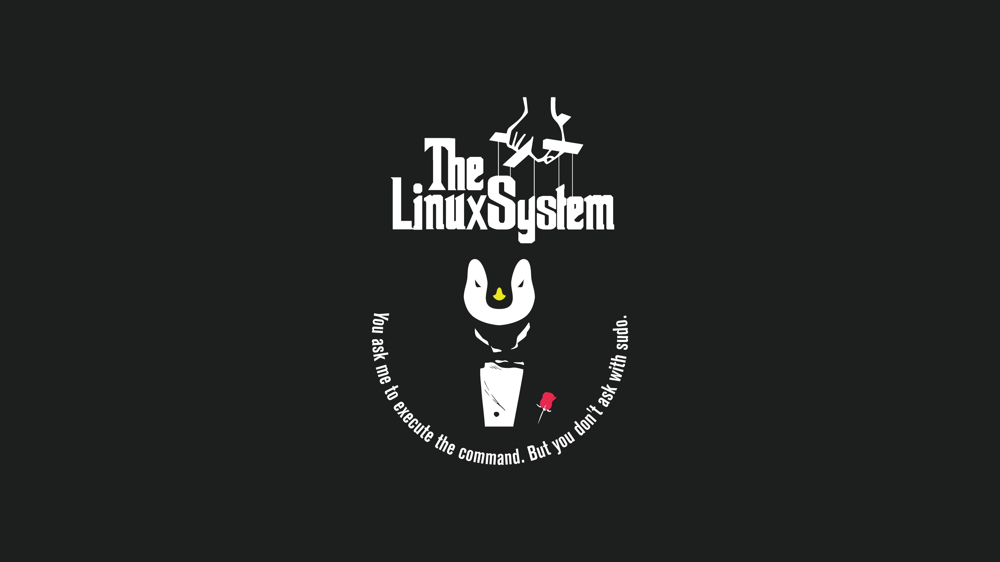

# RootFather Wallpapers

A collection of copyright-free wallpaper


## Quick install

Quickly download these wallpapers into your <code>Pictures/wallpapers</code> folder:

```bash
git clone https://github.com/TheRootFather/wallpapers
if [ -d "~/Pictures/wallpapers" ]; then
  mkdir ~/Pictures/wallpapers
fi
mv wallpapers/*.jpg ~/Pictures/wallpapers
mv wallpapers/*.png ~/Pictures/wallpapers
rm -rf wallpapers/
```

## Wallpapers




